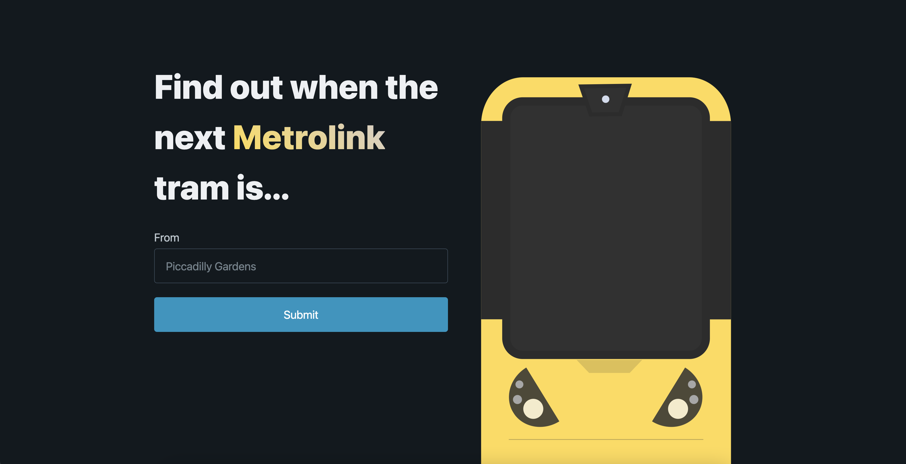

# Metrolink Tram Times PWA

A PWA that displays the next few Manchester Metrolink Trams from the specified tram stop.



https://startling-froyo-7b5dbe.netlify.app/

**Tech stack:**
- [Astro](https://astro.build/)
- React
- TypeScript
- [Pico CSS](https://picocss.com/)
- [Astro PWA](https://github.com/vite-pwa/astro)
- Python
- Netlify

## 🧞 Commands

All commands are run from the root of the project, from a terminal:

| Command                | Action                                           |
| :--------------------- | :----------------------------------------------- |
| `npm install`          | Installs dependencies                            |
| `npm run dev`          | Starts local dev server at `localhost:3000`      |
| `npm run build`        | Build your production site to `./dist/`          |
| `npm run preview`      | Preview your build locally, before deploying     |

## Autocomplete

The autocomplete feature is powered by a JSON file (`src/data/tramStops.json`) that is generated by a Python script which lives in `tram-stops/get-tram-stops.py`. 

This Python script reads a `.txt` file, which can be downloaded from [here](https://ckan.publishing.service.gov.uk/dataset/gm-public-transport-schedules-gtfs/resource/0002e66d-74b8-4ca2-af03-a9241802c34b?inner_span=True). This file will only need to be re-downloaded if a new tram line gets created.

The `.txt` file is circa ~15k lines and contains every single public transportation stop in Manchester. We only care about the tram stops so the Python script filters through the file and returns a JSON file containing only the tram stops.

The TFGM API needs some tram stop names to be provided in a specific non-user friendly way so the Python script generates a key-value pair, in which the key is the TFGM API friendly name and the value is the user-friendly name. 

```
  { "St Peter''s Square": "St Peter's Square" }
```

To run the Python script run:

```
/usr/bin/python3 ./tram-stops/get-tram-stops.py
```

## Nice to haves

Features that would be nice to have but weren't necessary in the original build of this PWA. These could be picked up at a later date.

- Add dark/light theme toggler
- Give user ability to sort info by wait time (default) or destination in alphabetical order
- Have a "your previous searches" and autocomplete based on them too? Only valid searches get stored. Only store up to 4 recent searches
- When a user has searched for their tram stop they should be able to navigate directly to search results on tram stop click rather than having to press the submit button [DONE]
